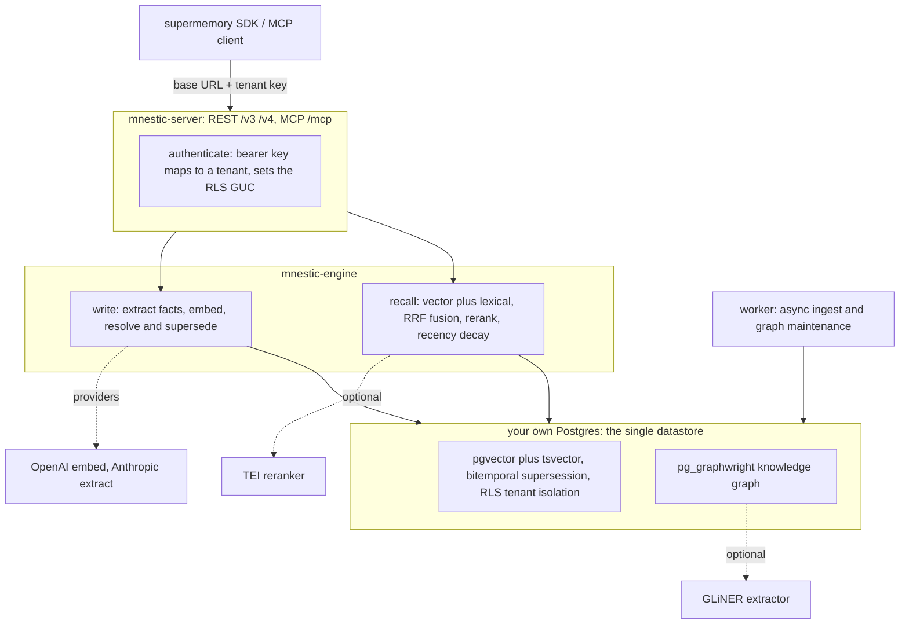

# Mnestic

[](https://github.com/hoofader/pg_mnestic/actions/workflows/ci.yml)

**Long-term memory for AI agents, in the Postgres you already run, and a drop-in backend for the
[supermemory](https://supermemory.ai) SDK.**

Mnestic gives agents persistent memory: it extracts facts from conversations, recalls them across
sessions, and supersedes them when they change, with no memory SaaS in the path. Your users'
memories live in your own Postgres, and tenant isolation is enforced by the database (RLS), not
by a field the caller must remember to pass. Run it as a server or embed it as a Rust library.

> Mnestic is the product; `pg_mnestic` is this repo and the optional accelerator extension.

## Drop-in supermemory compatibility

Mnestic serves the supermemory wire API (`/v3/documents`, `/v3/search`, `/v4/search`,
`/v4/profile`, `/v4/memories`) and MCP, so the official supermemory SDKs are clients of it with
no change beyond the base URL:

```ts
import Supermemory from 'supermemory';

const client = new Supermemory({
  baseURL: 'http://localhost:8080',          // your Mnestic, not the cloud
  apiKey: process.env.SUPERMEMORY_API_KEY,    // a tenant key from issue-key
});

await client.add({ content: 'I ship on Fridays.', containerTag: 'me' });
const { results } = await client.search.memories({ q: 'when do I ship', containerTag: 'me' });
```

Same for the Python SDK (`base_url=`) and for MCP clients (point them at
`http://localhost:8080/mcp`). Two claims, kept separate on purpose:

- **Wire compatibility is tested, not asserted.** CI drives the real `supermemory` npm SDK
  against a live Mnestic on every push (the `sdk conformance` job): add, search, profile,
  versioned update, forget.
- **Recall-quality parity is not yet benchmarked.** The head-to-head harness
  ([`docs/06-comparison.md`](docs/06-comparison.md)) is built, but the numbers are not published
  yet. We will not claim parity until it shows parity.

What works and the out-of-scope SaaS surface: [`docs/04-compatibility.md`](docs/04-compatibility.md).
Pointing SDK and MCP clients at it: [`docs/05-clients.md`](docs/05-clients.md).

## How it works



- **Write (`add`):** an LLM extracts atomic facts from the text; each is embedded (`pgvector`)
  and indexed for lexical search. A new fact that contradicts an older one supersedes it, kept as
  a version (bitemporal), so recall sees the current truth and history is not lost.
- **Recall (`search`):** hybrid retrieval (vector + lexical) fused with Reciprocal Rank Fusion,
  an optional self-hosted reranker, and recency decay on event time.
- **Isolation:** every row carries a `tenant_id`, and Postgres RLS (`FORCE`) keyed on the
  authenticated key blocks cross-tenant reads even if a query forgets the filter. The server runs
  as a non-superuser role, so the database enforces the boundary, not the application.
- **Profiles and graph:** durable facts roll into a per-actor profile; an RLS-aware knowledge
  graph (`pg_graphwright`) links memories that share an entity.

## How it compares

| | Where memory lives | Tenant isolation | Extraction + supersession | supermemory SDK |
|---|---|---|---|---|
| supermemory (hosted) | their cloud Postgres | `containerTag` filter | yes | native |
| mem0 | pluggable store | application-level | yes | no |
| raw `pgvector` + a prompt | your Postgres | you build it | you build it | no |
| **Mnestic** | **your Postgres** | **RLS, database-enforced** | **yes** | **drop-in** |

The honest differentiator: supermemory scopes by a `containerTag` the application passes; Mnestic
enforces tenant isolation in the database, so a request cannot read another tenant's rows even if
the application forgets the filter.

## Quick start

```sh
./quickstart.sh
```

Brings up Postgres, the server, and the worker, and prints a tenant key plus a `curl` example. It
generates database passwords into `.env` on first run, so the one-command flow needs no editing.
For real recall, set `OPENAI_API_KEY` (embeddings) and `ANTHROPIC_API_KEY` (extraction) in `.env`
first; without them it runs with mock providers (the API works, but recall is non-semantic). The
first build is slow because it compiles the Postgres extensions and the server. The server listens
on `http://localhost:8080`; point a supermemory SDK or MCP client straight at it
([`docs/05-clients.md`](docs/05-clients.md)). Stop with `docker compose down` (`-v` also wipes the
data). Optional sidecars: `./quickstart.sh --rerank` (the reranker) and `--graph` (the GLiNER
entity extractor).

## Status

`0.1.0`, MIT. The supermemory wire API is conformance-gated in CI; tenant isolation is enforced by
RLS under a non-superuser role and tested. Not done yet: a published recall-quality benchmark
(the harness exists), the `mnestic-py` and `mnestic-node` language bindings, and sharper graph
entity extraction (the default tokenizer is coarse; the optional GLiNER sidecar fixes it).
`pg_graphwright` is an early-stage extension. Run it, and tell us where recall misses.

## Docs

Design docs are the source of truth, see [`docs/`](docs/):

- [`docs/01-high-level-plan.md`](docs/01-high-level-plan.md) - the thesis and roadmap.
- [`docs/02-architecture.md`](docs/02-architecture.md)
- [`docs/03-low-level-design.md`](docs/03-low-level-design.md)
- [`docs/04-compatibility.md`](docs/04-compatibility.md) - the supermemory wire surface, what is and isn't implemented.
- [`docs/05-clients.md`](docs/05-clients.md) - pointing supermemory SDK and MCP clients at Mnestic.
- [`docs/06-comparison.md`](docs/06-comparison.md) - the head-to-head harness: Mnestic vs supermemory over one wire.

Operational guides: [`DEPLOYMENT.md`](DEPLOYMENT.md), [`MIGRATIONS.md`](MIGRATIONS.md),
[`SECRETS.md`](SECRETS.md), [`GDPR.md`](GDPR.md).

## Crates

- `mnestic-core` - domain types, provider traits, and the pure resolution logic (`decide`). No DB, no network.
- `mnestic-store` - Postgres access over `sqlx`, embedded migrations, RLS policies, and the SQL for recall and the metadata-filter builder.
- `mnestic-model` - provider impls. The mock impls are always built and network-free; the cloud providers sit behind features: `openai`, `anthropic`, and `rerank` (a self-hosted TEI reranker).
- `mnestic-engine` - the orchestration library: the write path (extract, embed, resolve), recall, the supersession chain, relation classification, and the graph maintenance hooks.
- `mnestic-server` - the REST + MCP server (`serve` feature) and the operator CLIs (`cli` feature): `serve`, `worker`, `issue-key`, `list-keys`, `revoke-key`, `export-actor`, `purge-actor`.
- `mnestic-eval` - a memorybench-style evaluation harness: ingest a benchmark's conversations, answer its questions from recall, and grade the answers (accuracy, recall latency, context size). The `real` feature adds the Claude-backed providers and the `memorybench` binary.

Still deferred (in the LLD module layout, not built): `mnestic-py` (PyO3 wheel) and
`mnestic-node` (napi-rs npm package).

## Database

Postgres 16 with `pgvector` (`halfvec(1536)`), `pg_graphwright` (the knowledge graph), and
`pgsql-http` (the optional GLiNER extractor bridge). These are not all in any public image, so
the tests, CI, and a deploy run the image built by [`docker/pg/Dockerfile`](docker/pg/Dockerfile)
(pgvector plus the extensions, built from source). Build it once:

```sh
docker build -t mnestic-pg:dev docker/pg
```

`migrations/` holds the SQL schema and RLS policies. Shipped migrations are frozen (see
`MIGRATIONS.md`).

## Running tests

The integration tests start a throwaway `mnestic-pg:dev` container via testcontainers, so build
that image first (above) and have Docker running. Then:

```sh
cargo test --workspace --all-features
```

`--all-features` so the feature-gated provider, `serve`, `rerank`, and CLI code is exercised. The
live cloud-provider tests are `#[ignore]`, so no API keys are needed.

The supermemory SDK conformance suite drives the real `supermemory` npm SDK against a live
Mnestic; CI runs it on every push and you can run it locally:

```sh
conformance/run.sh
```

## Running the server

```sh
cargo run --features serve --bin serve     # needs DATABASE_URL and provider keys
cargo run --features cli --bin issue-key <tenant-external-id>   # mint a tenant key
```

`DATABASE_URL` is the non-superuser runtime role; set `MNESTIC_MIGRATION_DATABASE_URL` (a
superuser) to have the server run migrations and provision the runtime role separately, so it
serves under RLS. Set `MNESTIC_MOCK_PROVIDERS=1` to run keyless with mock providers (conformance
and local demos only, never production). See `DEPLOYMENT.md` for TLS, the migration/runtime
roles, the worker, the reranker, and the graph extractor.

## License

MIT. See [`LICENSE`](LICENSE).
